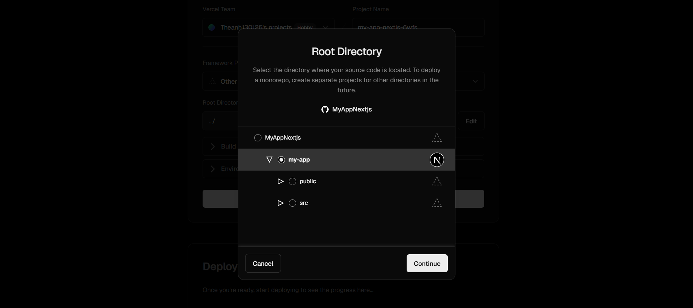

# MyAppNextjs
Tutorial Nextjs

1. Setup project với create-next-app

npm install -g yarn

yarn --version 

npx create-next-app --ts
# or
yarn create next-app --typescript

| Tuỳ chọn                        | Trạng thái bạn chọn                   |
| ------------------------------- | ------------------------------------- |
| Tên project                     | `my-app`                              |
| Dùng ESLint                     | ✅ Yes *(có kiểm tra lint/code style)* |
| Dùng Tailwind CSS               | ✅ Yes *(dùng CSS framework hiện đại)* |
| Code nằm trong thư mục `src/`   | ✅ Yes *(cấu trúc sạch hơn)*           |
| Dùng App Router                 | ✅ Yes *(kiến trúc router mới)*        |
| Dùng Turbopack (dev server mới) | ✅ Yes *(nhanh hơn Webpack)*           |
| Tùy chỉnh import alias `@/`     | ✅ Yes *(giữ mặc định là `@/*`)*       |

yarn add next react react-dom  

//Theo document 

npx create-next-app@latest

//Deploy nhớ chọn vào trong luôn 
